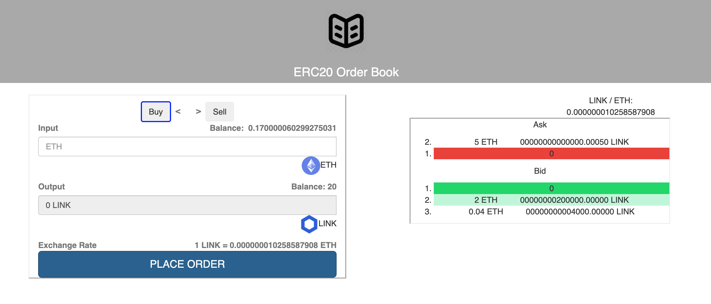

# On-Chain Order Book

This application showcases an on-chain orderbook that allows a user to buy and sell ERC20 tokens while displaying open orders in the UI. This orderbook connects to the Rinkeby testnet.

Due to the time limitations:

1. Swapping is restricted to ETH and LINK only
2. I leveraged a 3rd party library for the order book component - certain styling limitations made alignment challenging
3. In an effort to get the end-to-end system functional, there is some tech debt that can be addressed (performance, styling, code cleanup, etc.)

** This is for testing purposes only. All addresses and keys are for the Rinkeby testnet. **

# App Flow



## Front End / UI

### Left Panel - Swap Window

This window allows the user to swap between ETH and LINK. I loaded the LINK contract from the Rinkeby network, and I loaded the LINK/ETH price feed from the Chainlink price feed oracle.

The user can toggle between buying ETH for LINK, and selling LINK back for ETH. When buying, upon clicking "PLACE ORDER", a transaction is sent to the Rinkeby chain where I have deployed an Order Book contract (details below in the "Smart Contract" section).

## Smart Contracts

Upon placing an order, the order book contract stores the order in a mapping table. Separate mapping tables are used for bids and asks. An order ID is also stored and used for updates and retrieval.

I used Remix to build the order book contract. I deployed to a local Ganache chain as well as the Rinkeby testnet (both via the Remix Injected Web3 functionality).

## Addresses

priceFeedAddress: "0x4d38a35C2D87976F334c2d2379b535F1D461D9B4"
chainlinkTokenAddress: "0x01BE23585060835E02B77ef475b0Cc51aA1e0709"
orderBookContractAddress: "0x7383deA1f066F424Fb3A989e4277Ade74F9d9ad1" (Rinkeby)

## Developer Docs

### Prerequisites

1. Install Node v17+
   - Refer to https://nodejs.org/en/ to install nodejs
2. Install Web3
   - `npm install web3`
3. Install Truffle (I used 5.0.0)
   - `npm install truffle@5.0.0`
4. Install Ganache CLI
   - `npm install ganache-cli`
5. Install HDWallet Provider
   - `npm install @truffle/hdwallet-provider`
6. Register for Infura account and set up node on Rinkeby network (ETH testnet)
7. Install dotenv
   - `npm install dotenv`
8. Install Metamask and configure connection to Rinkeby testnet
   - You will also need to fund the wallet with test ETH from a Rinkeby faucet

### Install create-react-app

Install create-react-app npm package globally. This will help to easily run the project and also build the source files easily. Use the following command to install create-react-app

```
npm install -g create-react-app
```

## Cloning and Running the UI Locally

Clone the project into local

Install all the npm packages. Go into the project folder and type the following command to install all npm packages

```
npm install
```

In order to run the application, type the following commands

```
cd order-book
npm start
```

The Application Runs on **localhost:3000**

## Resources

**create-react-app** :
https://github.com/facebook/create-react-app

**React Bootstrap** : https://react-bootstrap.github.io/getting-started/introduction/
